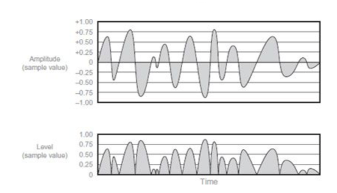
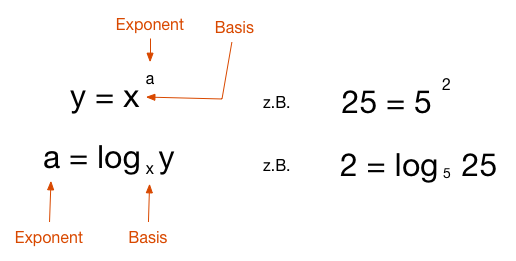
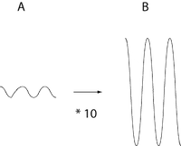
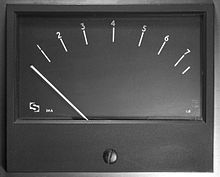
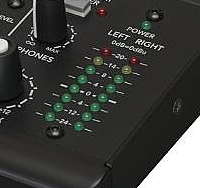
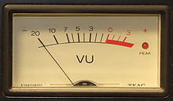
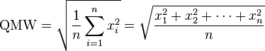
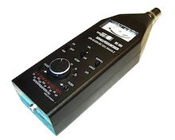

# Klasse1 /Dezibel, Meter und Fader

### Hausaufgabe
Kapitel 11 , Mixing Audio : Concepts, Practices, and Tools 

## Terminologien

### Lautstärke ( Loudness )
Die Lautstärke eines Schalls ist ein Maß dafür, wie laut er vom **Menschen als Hörereignis** empfunden wird.

### Amplitude (Amplitude)
ist eine charakterisierende Auslenkung einer Schwingung, die so genannte Elongation. Es ist die Auslenkung einer physikalischen Größe, z.B. einer elektrischen Spannung, aus ihrer Ruhelage (0-Punkt) bis zu einem **positiven oder negativen** Wert. Die Amplitude (a) wird in einer  **physikalischen Größe** angegeben, beispielsweise als Spannung, Strom, Temperatur usw.

### Spitzenamplitude (Peak Amplitude)
Die maximale Elongation einer Schwingung, von der Position der Null-Linie aus gemessen.

### Pegel (Level)
Ein Pegel ist ein Wert einer **physikalischen Größe** in einem Übertragungssystem, der zur Bestimmung der Spannungen, Ströme oder Leistungen verwendet wird. Der Pegel wird häufig als logarithmisches Verhältnis in der Einheit Dezibel (dB) angegeben.

### Bel/Dezibel (Bell/Decibel)
Das Bel ist eine Hilfsmaßeinheit zur Kennzeichnung von Pegeln. Das Bel dient zur Kennzeichnung des **dekadischen Logarithmus** des Verhältnisses zweier gleichartiger Energie. In der Regel wird statt des Bels das Dezibel (Einheitenzeichen *dB*) verwendet, also der zehnte Teil eines Bels.
Das dB allein ist eine reine Verhältnisangabe, ähnlich wie das Prozent (%). Es sagt also **nichts aus über absolute Größen**.
### Logarithmus

#### Quiz

Beispiel:

B / A = 10

Dezibel = 20 * Bel

Das dB ist definiert als der zwanzigste Teil der dekadischen Logarithmus diees zu messenden Verhältnisses x1/x2 :  20 * log(10) x1/x2

#### Experiment 1 / dB-Abtastwert Umwandler
Programmieren Sie dB-Abtastwert / Abtastwer-dB Umwandler in Max.

### Aussteuerungsmesser (Meter)
ist ein Messgerät zur Kontrolle der Aussteuerung bei Tonaufnahmen und Beschallung. Aussteuerungsmesser werden für die korrekte Aussteuerung eines Audiosignals benötigt.
Die Anzeige des Messwertes erfolgt durch mechanische Zeiger oder Balkenanzeige.

### Mechanischer Zeiger (Mechanical Meter)

### Balkenanzeige (Bar Meter)
 

### Spitzenpegelmesser (Peak Meter)
Spitzenpegelmesser messen die (maximalen) Amplitudenwerte von elektrischen Signalen. Das können sowohl positive als auch negative Amplituden sein.

### vu-Meter (VU meter)
 ist ein Aussteuerungsmesser, also ein Messinstrument zur Beurteilung der Aussteuerung in der Tontechnik. Die Einschwingzeit, die das vu-Meter benötigt, um bei einem 1-kHz-Sinusdauersignal von 0 vu 99 % der Bezugsanzeige 0 vu zu erreichen, muss 300 ms ±10 % betragen. Das Überschwingen des Zeigers muss hier zwischen 1 % und 1,5 % liegen. Die Rücklaufzeit nach Abschalten des Testsignals soll der Einschwingzeit gleichen. Durch diese Ballistik wird eine Anzeigecharakteristik erzeugt, die dem Hörempfinden des menschlichen Ohrs grob angenähert ist.

VU ... volume units

#### Experiment 2 / Kurzes Rauschen
Programmieren Sie ein Patch, das ein sehr kurzes (30 Samples) weisses Rauschen erzeugt. Vergleichen Sie die Lautstärke des kurzen Rauschens mit einem langen Rauchen.

### Quadratisches Mittel (Root Means Square)
Das quadratische Mittel ist eine Methode zur Mittelwert-Bildung einer Zahlen- oder Messreihe.

### Schalldruckpegel (Sound Pressure Level / SPL)
Der Bezugswert für Luftschall wurde Anfang des 20. Jahrhunderts festgelegt. Dieser Schalldruck wurde für die Hörschwelle des menschlichen Gehörs bei der Frequenz 1 kHz gehalten.

|Situation| dB  SPL|
|------------------|---------|
| Schmerzschwelle | 134 dB SPL |
| Gehörschäden bei kurzfristiger Einwirkung | 120 dB SPL	~ |
| Düsenflugzeug 100 m entfernt | 110–140 dB SPL	|
| 1 m entfernt / Diskothek	|	~ 100 dB SPL|
| Gehörschäden bei langfristiger Einwirkung	 | ab 85 dB	SPL|
| Hauptverkehrstrasse 10 m entfernt	| 	80–90 dB SPL|
| Pkw, 10 m entfernt	| 60–80 dB SPL|
| Fernseher in 1 m Zimmerlautstärke	| ca. 60 dB	SPL|
| Normale Unterhaltung, 1 m entfernt | 40–50 dB	SPL|
| Sehr ruhiges Zimmer	|	20–30 dB SPL|
| Blätterrauschen, ruhiges Atmen | 10 dB SPL |
| Hörschwelle | 0 dB SPL |

### Schallpegelmesser (Sound Level Meter)
Ein Schallpegelmesser ist ein Messgerät zur Bestimmung von Schalldruckpegeln. Sie zeigen Pegelwerte in Dezibel (dB SPL) an, verbunden mit der Angabe des Pegels; insbesondere werden Frequenz- und Zeitbewertung angezeigt. Schallpegelmesser finden dort Anwendung, wo eine Quantifizierung von Geräuschen notwendig ist, wie z. B. bei der Beurteilung von Fluglärm, Maschinenlärm, Umweltlärm und Lärm am Arbeitsplatz.

