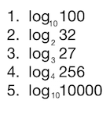

# Klasse1 /Dezibel, Meter und Fader

[Kapitel-12](http://www.chikashi.net/?sdm_downloads=k12)

### Logarithmus

### Quiz

Beispiel:

B / A = 10

Dezibel = 20 * Bel

## Experiment 
## Terminologien

### Lautstärke
Die Lautstärke eines Schalls ist ein Maß dafür, wie laut er vom Menschen als Hörereignis empfunden wird.

### Bel/Dezibel (Bell/Decibel)
Das Bel ist eine Hilfsmaßeinheit zur Kennzeichnung von Pegeln. Das Bel dient zur Kennzeichnung des **dekadischen Logarithmus** des Verhältnisses zweier gleichartiger Energie. In der Regel wird statt des Bels das Dezibel (Einheitenzeichen *dB*) verwendet, also der zehnte Teil eines Bels.
Das dB allein ist eine reine Verhältnisangabe, ähnlich wie das Prozent (%). Es sagt also **nichts aus über absolute Größen**.

Das dB ist definiert als der zwanzigste Teil der dekadischen Logarithmus des zu messenden Verhältnisses x1/x2 :  20 * log(10) x1/x2

### Gehörrichtige Lautstärke (Equal-loudness contour)
beschriebt wie Schallaufnahmen so wiedergegeben werden, dass sie bei unterschiedlichen Lautstärken einen ähnlichen Höreindruck ergeben.

Die Lautstärkewahrnehmung ist stark frequenzabhängig. Die Abhängigkeit der Lautstärkewahrnehmung von der Frequenz fällt darüber hinaus für unterschiedliche Lautstärkepegel unterschiedlich aus.

### Schalldruckpegel (Sound Pressure Level / SPL)
Der Bezugswert für Luftschall wurde Anfang des 20. Jahrhunderts festgelegt. Dieser Schalldruck wurde für die Hörschwelle des menschlichen Gehörs bei der Frequenz 1 kHz gehalten.

|Situation| dB  SPL|
|------------------|---------|
| Schmerzschwelle | 134 dB SPL |
| Gehörschäden bei kurzfristiger Einwirkung | 120 dB SPL	~ |
| Düsenflugzeug 100 m entfernt | 110–140 dB SPL	|
| 1 m entfernt / Diskothek	|	~ 100 dB SPL|
| Gehörschäden bei langfristiger Einwirkung	 | ab 85 dB	SPL|
| Hauptverkehrstrasse 10 m entfernt	| 	80–90 dB SPL|
| Pkw, 10 m entfernt	| 60–80 dB SPL|
| Fernseher in 1 m Zimmerlautstärke	| ca. 60 dB	SPL|
| Normale Unterhaltung, 1 m entfernt | 40–50 dB	SPL|
| Sehr ruhiges Zimmer	|	20–30 dB SPL|
| Blätterrauschen, ruhiges Atmen | 10 dB SPL |
| Hörschwelle | 0 dB SPL |

### Schallpegelmesser (Sound Level Meter)
Ein Schallpegelmesser ist ein Messgerät zur Bestimmung von Schalldruckpegeln. Sie zeigen Pegelwerte in Dezibel (dB SPL) an, verbunden mit der Angabe des Pegels; insbesondere werden Frequenz- und Zeitbewertung angezeigt. Schallpegelmesser finden dort Anwendung, wo eine Quantifizierung von Geräuschen notwendig ist, wie z. B. bei der Beurteilung von Fluglärm, Maschinenlärm, Umweltlärm und Lärm am Arbeitsplatz.

 an einem Flughafen

#### HA
Lesen Sie Mixing Audio : Concepts, Practices, and Tools 

