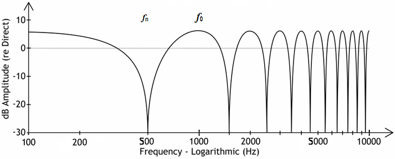

# Klasse2 Phase 

### Hausaufgabe 
Kapitel 13 , Mixing Audio : Concepts, Practices, and Tools 
Panning (21 Seiten)

## Experiment

### Patch 1: Phasenvershiebung / Phasenumkehr

### Patch 2: Haas Trick

### Patch 3: Out of Speaker Trick

## Terminologien

### Phase (Phase)
Die Phase einer Welle gibt an, in welchem Abschnitt innerhalb einer Periode sich die Welle zu einem Referenzzeitpunkt befindet. 

### Phasenverschiebung (Phase Shift)
Die Phasenverschiebung ist ein Begriff der Physik und Technik. Zwei Schwingungen sind gegeneinander phasenverschoben, wenn deren Periodendauern zwar übereinstimmen, die Zeitpunkte ihrer Nulldurchgänge aber nicht.

### Phasenumkehr (Phase Inversion)
bedeutet, die Plus- und Minus-Pole einer Wechselspannungsquelle zu vertauschen. Umgesetzt wird dies mittels einer elektronischen Schaltung, indem einfacherweise die beiden Anschlüsse gewechselt werden, was deutlich mit Verpolung bezeichnet werden sollte.

Die Phasenumkehr wird in der Tontechnik verwendet, um falsch gepolte Tonsignale in ihrer Phase zu korrigieren, oder um richtig gepolte, jedoch unerwünschte, Phasen absichtlich umzukehren, damit sich diese und die Phasen des zugemischten Originalsignals gegeneinander auslöschen und somit leiser werden oder ganz verstummen.

### Kammfilter (Comb Filter)
Ein Kammfilter ist ein Filter, das aus Signalen Gruppen bestimmter Frequenz filtert. Im Unterschied zu Low- und Highpass ist es durch mehrere Filterfrequenzen im gleichen Frequenzabstand gekennzeichnet. Der Amplitudengang (Pegel über die Frequenz) des Frequenzgangs des Kammfilters hat ein kammartiges Aussehen, woher das Kammfilter seinen Namen hat.

Wird ein Signal mit einer zeitverzögerten Kopie desselben „gemischt“ (additiv überlagert), entsteht ein kammgefiltertes Signal. 
In der Praxis der Tontechnik beispielsweise entstehen häufig unbeabsichtigt Überlagerungen mit verzögerten Signalen – und damit auch Kammfiltereffekte: Bei der Mikrofonaufnahme können im Raum erscheinende Reflexionen mit einer Verzögerung zwischen 2 und 15 ms zu auffälligen, unangenehm störenden Klangfärbungen führen.