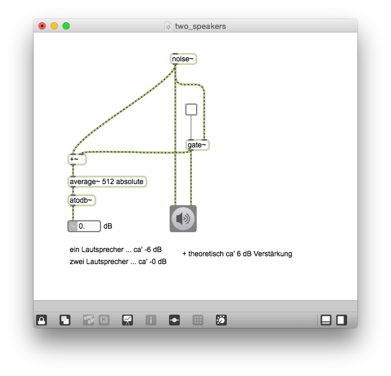

# Klasse3

## Panning 

Mixing Audio - Kapitel 13

## Experiment

### Patch 1 / Zwei Lautsprecher und die Position des Klangs

### Patch 2 / 6 dB Verstärkung

 

### Patch 3 / Linear Panning

Leiser in der Mitte.

### Patch 4 / Square Root Panning

Besser für unsere Ohren aber die Geschwindigkeit der Klangbewegung ist nicht immer gleich.

### Patch 5 / Equal power Panning

Der beste Kompromiss. Fast Alle DAWs und Mischpulte verwenden Equal-Power-Panning.

## Problem mit Monauralisierung

### Patch 6 / Problem des Equal-Power-Panning bei Monauralisierung

Mono Signal = Links * 0.5 + Recht * 0.5

Bei der Monauralisierung wird der Klang in der Mitte +3 dB verstärkt.

### Patch 7 / Linear Panning und Monauralisierung

Mit Linear-Panning bekommen wir dieses Problem nicht.

## Terminologien

### Panpot / Panoramapotentiometer
Mit einem Panpot wird die Lautstärkeverteilung eines Audiosignals auf zwei Kanäle (Stereo) geregelt. 

### Laufzeitdifferenz (Interaural Timing Difference / ITD)
wird in der Akustik beim natürlichen Hören (Richtungshören) als ITD (Interaural Time Difference) und in der Tontechnik als Δ t beim Erzeugen der Hörereignisrichtung als Lautsprechersignale zwischen den Stereo-Lautsprechern verwendet, also auf der Lautsprecherbasis. Die Laufzeitdifferenz wird üblicherweise in Millisekunden (ms) angegeben.

### Pegeldifferenz (Interaural Level Difference / ILD)
wird in der Akustik beim natürlichen Hören (Richtungshören) als frequenzabhängiges ILD (Interaural Level Difference) und in der Tontechnik als frequenzneutrales Δ L beim Erzeugen der Hörereignisrichtung als Lautsprechersignale zwischen den Stereo-Lautsprechern verwendet, also auf der Lautsprecherbasis. Die Pegeldifferenz wird üblicherweise in Dezibel (dB) angegeben.

[DSP Eartraing Course](http://folk.ntnu.no/oyvinbra/gdsp/Lesson1Panning.html)