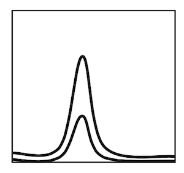
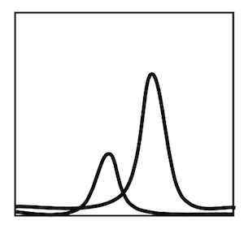

# Klasse4

# EQ 1

## Reverb

### Verdeckung (Masking )
bewirken beim menschlichen Gehör, dass der Mensch in einem Geräusch bestimmte Frequenzanteile nicht oder nur mit verringerter Sensitivität wahrnehmen kann.

### Simultane Verdeckung:
Ein Signal mit niedrigem Pegel wird durch ein zeitgleich auftretendes Signal mit hohem Pegel maskiert.

### Temporäre Verdeckung:
Ein Signal mit niedrigem Pegel wird durch ein Signal mit hohem Pegel, welches nach (bis 200ms) oder kurz vor (bis 50ms) dem schwachen Signal auftritt ebenfalls maskiert.

