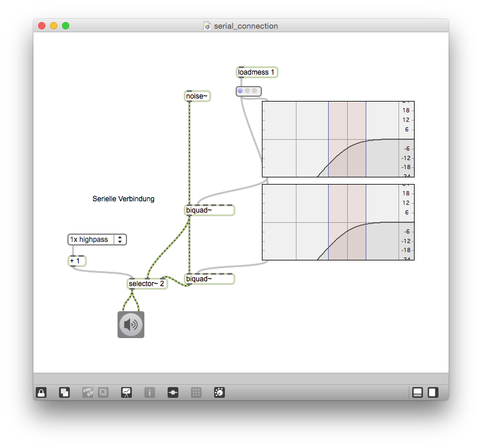
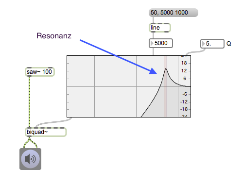
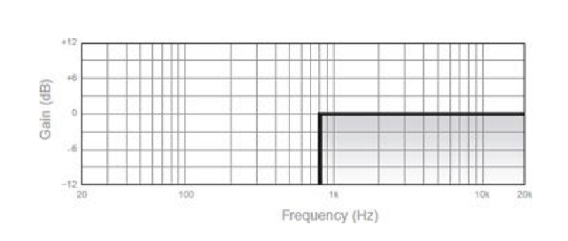

# Klasse4

# EQ 1

## Experiment

### Patch 1 / Serienfilter

### Patch 2 / Resonanz

## Teminologien

### Frequenzgang (Frequency-Response)
Der Frequenzgang ist der Zusammenhang zwischen Ein- und Ausgangssignal einer Ausrüstung bezüglich der Amplitude. 

### Hochpassfilter (Highpass-Filter)
Als Hochpass bezeichnet man Filter, die Frequenzen oberhalb ihrer Grenzfrequenz annähernd ungeschwächt passieren lassen und tiefere Frequenzen dämpfen.

### Tiefpassfilter (Lowpass-Filter)
schwächt hohe Frequenzen bis zu einer Grenzfrequenz ab. Tieffrequente Signalanteile werden durchgelassen. 

### Grenzfrequenz (Cutoff-Frequency)
ist derjenige Wert der Frequenz, bei dessen Überschreitung die Signalamplitude am Ausgang eines Bauteils unter einen bestimmten Wert sinkt.

### Flankensteilheit (Steepness)
ist die Steilheit der Bereichsenden von Filtern wie Hochpass,Tiefpass, oder Bandpass, ausgedrückt in Dezibel pro Oktave (dB/Okt). Normalerweise 6 dB/Okt.

### Resonanz (Resonance)
Einige Tiefpass- oder Hochpassfilter sorgen dafür, daß diejenigen Töne, die in der unmittelbaren Nähe der Grenzfrequenz liegen, besonders verstärkt, alle anderen abgeschwächt werden. Dieser Effekt wird Resonanz genannt, und kann so stark werden, daß das Filter anfängt, von alleine mit der Grenzfrequenz zu schwingen. 

### high-Shelve Filter

### Low-Shelve Filter

### Parametric Filter

### Peak notch Filter

### Allpass Filter

### 3 Bänder EQ (3-band EQ)

### 4 Bänder EQ (4-band EQ)

### 5 Bänder EQ (5-band EQ)

## Andere EQ
### Graphischer EQ
besitzt mehrere Schieberegler mit denen jeweils ein bestimmter Frequenzbereich angehoben oder abgesenkt werden kann. Die Anzahl der Frequenzbereiche, die bearbeitet werden können, ist von Gerät zu Gerät verschieden. Man spricht hier auch von Bändern: Mit einem 10-bandigen Equalizer können 10 verschiedene Frequenzbereiche unabhängig voneinander geregelt werden.

### Dynamischer EQ
Ein dynamischer EQ ist ein Werkzeug, dessen Filter Bereiche des Frequenzspektrums in Abhängigkeit von der Amplitude des Eingangssignals verstärken oder abschwächen.

### Sibilant (Sibilance)
Reibelaut, bei dessen Artikulation sich eine Längsrille in der Zunge bildet, über die die ausströmende Luft nach außen gelenkt wird (z. B. s, z, sch)

